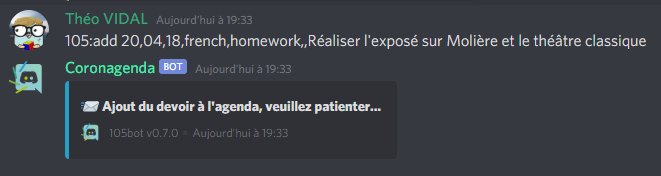
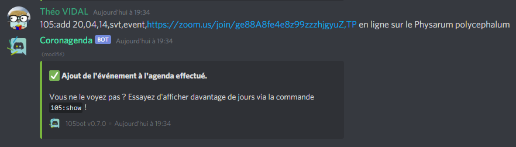
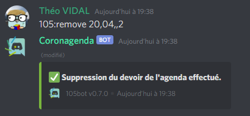
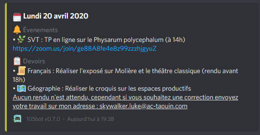

<div align="center">
    
    <h1>105bot</h1>
    <h3>📌 Organization tools on Discord 🤖</h3>
    <a href="https://discord.com/api/oauth2/authorize?client_id=690904891929133190&permissions=161856&scope=bot">Invite</a> - <a href="https://discord.gg/QGGSTXy">Discord server</a> - <a href="https://trello.com/b/vEAgMsG0/105bot">Trello</a>
</div>

## 📖 Table of Contents

- [🌈 Features](#-features)
  - [Screenshots](#screenshots)
- [👨‍💼 User guide](#-user-guide)
- [👨‍🏫 Administrator guide](#-administrator-guide)
- [👨‍💻 Developer guide](#-developer-guide)
  - [Registering the bot](#registering-the-bot)
  - [Installation](#installation)
  - [Architecture](#architecture)
  - [Extend commands](#extend-command)
- [📜 Credits](#-credits)
- [🔐 License](#-license)

## 🌈 Features

### Agenda

- Write in a single place work with a text, link and even a subject
- Program events and receive notifications when they start
- Add weekly events, that repeat themselves on a specific day, and still get benefit of notifications
- Let many people maintain a single agenda - Stay organized collectively!

TL;DR: an agenda with work and events on Discord!






### Sessions

- Start a dynamic vocal session on Discord
- Get notified with a voice message when someone wants to participate
- Let users react based on their feelings

This feature is a lot inspired from BlackBoard Collaborate, a tool that I used for class during COVID-19 lock-down.

### Annotations

- Add a note and files to a message

### Polls

- Start a poll in any channel, proposing a variety of options (up to 20, which is the Discord reactions number limit)
- Choose from a variety of reactions : letters, numbers, shapes, and even food, transportation, animals and faces!

## 👨‍💼 User guide

Coming soon. Stay tuned!

## 👨‍🏫 Administrator guide

The bot isn't public _yet_, so there isn't any administrator!

## 👨‍💻 Developer guide

Thank you for taking part in the development of this bot ! Please follow these instructions to get started.

The project requires these dependencies:

- Git, in any form
- Ruby 2.6+
- Ruby gems listed in [Gemfile](./Gemfile)
- A sqlite database in your local filesystem (you can quickly create a file with the `sqlite` extension)

### Registering the bot

First of all, you must create a new app on the [Discord Developer portal](https://discordapp.com/developers/applications). Write down information about it, upgrade the app to a bot user and grab its token : it will serve to connect to the platform.

### Installation

Download the project on your computer using Git:

```bash
git clone https://github.com/exybore/105bot.git  # HTTP
git clone git@github.com:exybore/105bot          # SSH
```

Go to the `data` folder, rename files to simply `x.yml` and edit them:

- the `config` file is the main configuration for the bot. Everything is here: from authentication, to functional, to design
- the `strings` file serves as internationalization (i18n) in order to display information in the correct locale
- the `subjects` file lists available subjects

You can then run the bot by executing the `run.rb` script using Ruby.

### Extend commands

All the commands are located under the `src/commands` folder. They consist of a class inside the `Commands` module, extending the `Command` central class. Warning : every code you make must be located under the `HundredFile` module !

The structure is the following:

```ruby
require_relative 'command'

module HundredFive
  module Commands
    class Example < Command
      DESC = 'Some description to show in the help message.'
      CATEGORY = 'Category of the command'
      ARGS = {
        type: {
          description: 'Every argument has a type - here, Integer - and a default value.',
          type: String,
          default: 'homework'
        },
        day: {
          description: "If a value is required, don't set a default value - the system will notice the user.",
          type: Integer,
          default: nil
        }
      }

      def self.exec(context, args)
        # command content - do what you want!
      end
    end
  end
end
```

Inside the command :

- the `context` is the [Discordrb::EventsMessageEvent class](https://rubydoc.info/github/meew0/discordrb/Discordrb/Events/MessageEvent), in order to access message, channel, user, bot...
- the `args` is a hash containing arguments you asked with the exact same key

## 📜 Credits

- Libraries : [discordrb](https://github.com/meew0/discordrb), [pronote-api](https://github.com/Litarvan/pronote-api)
- Maintainer : [Théo Vidal](https://github.com/exybore)

## 🔐 License

[GNU GPL v3](./LICENSE)
